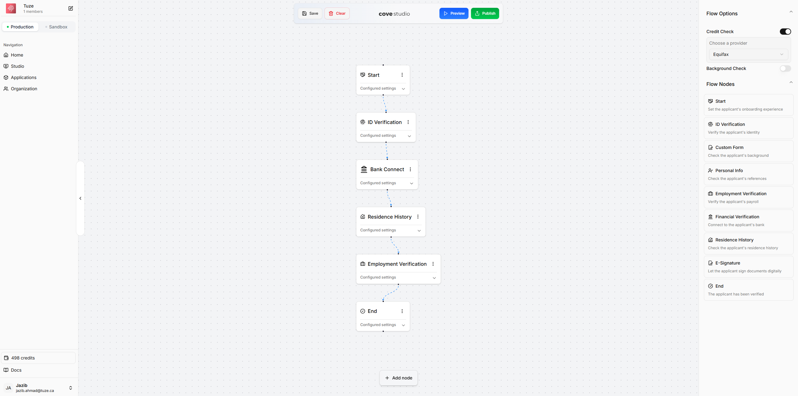

# Cove Studio Terminology

#### **Nodes**&#x20;

Nodes are the building blocks of a fintech workflow. Each node can provide a specific functionality. For example:

* **Employment Verification**: Validate employment directly through payroll systems.

* **Financial Verification**: Real-time insights into financial behaviors and income by connecting to the applicant's bank.

* **ID Verification**: Biometric and cross-national ID verification for applicants from 180+ countries.

* **Background Check**: Screen over 100,000 sources to identify potential fraud, criminal history, or risks.

* **Credit Report**: Access detailed credit reports from Equifax, TransUnion, and global credit databases.

* **Residence History**: Collect information about an applicant's past residence history.

* **Personal Info**: Collect references for applicants.

* **E-Signature**: Let applicants sign documents digitally.

* **Custom Form**: Add a custom form to the workflow.

More nodes are being added over time.

#### **Flows**

Flows allow you to connect multiple nodes together to create a fintech workflow. With Cove Studio, you can create and launch new flows in under 5 minutes.
Simply drag and drop the desired nodes, preview the flow, and once satisfied, hit Publish.

***

### Node Highlights

#### **Payroll Verification**

* **Why it matters**: Traditional employment verification (phone calls or pay stubs) is prone to forgery or inaccuracies. Payroll verification connects directly with payroll systems for instant, reliable data.

* **Time saved**: Eliminates the need to contact HR during office hours, saving realtors valuable time.

#### **Financial Verification**

* **Why it matters**: Manual income verification via pay stubs or statements is time-consuming and susceptible to falsification. Real-time bank data ensures authenticity.

* **Time saved**: Instantly verify financial data without manual cross-checking, giving peace of mind.

#### **Rent Transaction History & Landlord Reference Check**

* **Why it matters**: A record of missed rent payments is a key indicator of potential risks. Landlord references provide insights into tenant behavior (cleanliness, neighbor relations, etc.).

* **Time saved**: Automates landlord outreach and delivers comprehensive tenant history.

#### **Background Check**

* **Why it matters**: Uncovers fraud, crime records, eviction histories, and more through extensive database scans.

* **Time saved**: Reduces the research burden by consolidating information unavailable to individuals.

#### **ID Verification**

* **Why it matters**: Ensures applicants' identities are legitimate with biometric verification and global ID cross-referencing.

* **Time saved**: Avoids manual verification delays and prevents fraud attempts.

#### **Credit Report**

* **Why it matters**: Evaluates financial reliability based on debt management and payment history.

* **Time saved**: Automatically integrates with Equifax and / or TransUnion, saving institutions the cost and effort of running individual checks.

***

### Cost-Saving Features

1. **Applicant-Paid Screening**: Allow applicants to bear the cost of their screenings, demonstrating their commitment while reducing your expenses.

2. **Efficient Representations**: Realtors and representing agents can use the service to collect and verify tenant data upfront.

***

## Why Choose Cove?

**Problem**

Building fintech workflows—be it for lending, insurance, onboarding, or compliance—often involves integrating multiple vendors, managing complex APIs, and ensuring regulatory compliance. This process is time-consuming, costly, and prone to errors.

**Our Solution**

Cove simplifies this by offering a drag-and-drop platform that allows you to build, launch, and scale fintech workflows without writing code or managing multiple vendor integrations. Here's how:

* **Rapid Deployment**: Launch white-labeled financial products in minutes, not months. Cove handles the heavy lifting—integrations, compliance, and infrastructure—so you can focus on delivering value to your customers.

* **Unified Compliance**: With Cove's Compliance Vault, complete a single KYB process to gain instant access to over 30 fintech providers, streamlining your compliance requirements.

* **Scalable Infrastructure**: Cove's platform is designed to scale with your business, supporting high-volume workflows with robust monitoring, fallback logic, and infrastructure that scales automatically.

### **Asset Management Example**

One of the ways we sell to large apartment managers is by committing fraud — not actually but kind of.

We send fraudulent documents to apply to rental units → Leasing Teams review our documents/run screening on fake documents → We get rental offers for the properties and record the whole thing, send it to property managers in a short loom of what went down.

<iframe
  src="https://www.loom.com/embed/d2b8699687274d948b739a96bfb679be?sid=d3bc7ba7-fc21-495f-8330-9cb965417a24"
  frameborder="0"
  webkitallowfullscreen
  mozallowfullscreen
  allowfullscreen
  style={{
position: 'relative',
width: '100%',
height: '400px',
maxWidth: '100%',
}}
/>

[https://www.loom.com/share/d2b8699687274d948b739a96bfb679be?sid=94c3dcea-fe47-4a32-a98a-2035f7595d7f](https://www.loom.com/share/d2b8699687274d948b739a96bfb679be?sid=94c3dcea-fe47-4a32-a98a-2035f7595d7f)