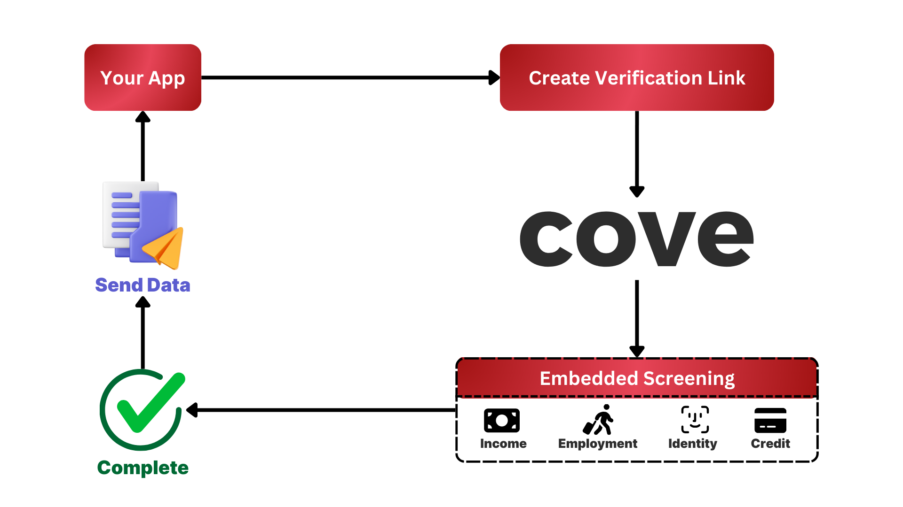
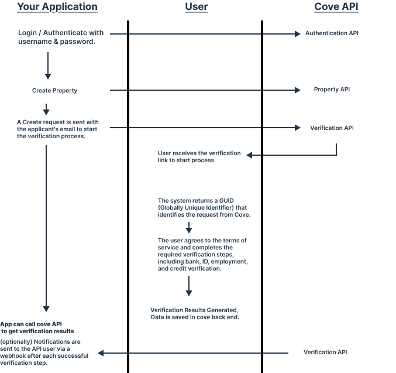

## Setting up

The first step to world-class documentation is setting up your editing environments.

<CardGroup cols="3">
  <Card title="Sign Up / Log In" icon="pen-to-square" color="blue" href="https://app.getcove.co">
    Make an account to run your first check!
  </Card>
</CardGroup>

### Get Started with Cove API

#### Introduction

The Cove API empowers you to build, manage, and optimize rental verification processes with ease. Whether it's property management or applicant screening, Cove offers reliable, secure, and efficient tools for your business needs.

#### **Sign Up or Log In**

Begin your journey by contacting [concierge@getcove.co]() to request your login credentials for API (These credentials will allow you to authenticate and access the Cove API) or make an account on [**our console**](https://app.getcove.co/).

### Simplify Rental Management with Cove

Cove’s API is built to simplify every step of your rental operations. From verifying tenant information to managing property data, Cove provides the tools to streamline your processes.

#### Core Steps to Get Started:

1. **Authenticate Your Requests** Start by logging into the API through the `/login` endpoint to generate your access token. Use this token to securely make API calls.

2. **Fetch or Manage Property Data** Use endpoints like `GET /property/{propertyId}` to retrieve property details or `POST /property` to create a new property record.

3. **Send Screening Requests** Initiate applicant screenings using `POST /screening/send`, which provides your users with a secure link to complete verification steps.

4. **Retrieve Screening Results** Access the results of completed screenings through endpoints like `GET /screening/data/{userId}`.

5. **Receive Webhook Notifications** Set up a webhook to receive notifications in real time for every completed verification step.

***

### Enhanced Control with Cove

At Cove, we prioritize giving you control over your rental operations. Our platform enables you to:

* **Securely Authenticate API Calls** with a bearer token and HTTPS communication.

* **Integrate Webhooks** to stay informed of completed actions instantly.

* **Customize Verification Pages** to align with your brand’s design and experience.

* **Monitor and Manage Requests** with detailed JSON responses and interactive documentation.

Start building the future of rental management with Cove API. Dive in, customize, and bring your operations to life with reliable and efficient solutions.

### API Chart Flow

