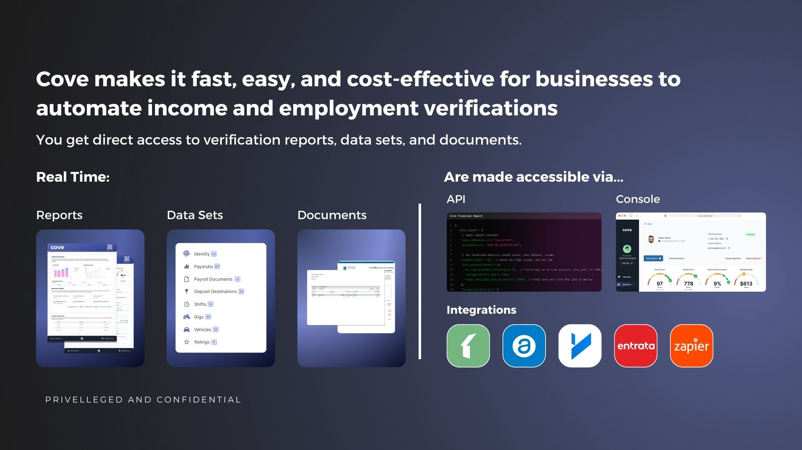

### Product Tiers and Features

#### **Lite Check**&#x20;

Cove Lite Check provides foundational verification tools that ensure quick and accurate tenant screening. Services include:

* **Background Check**: Screen over 100,000 sources to identify potential fraud, criminal history, or risks.

* **Credit Report**: Access detailed credit reports from Equifax, TransUnion, and global credit databases.

* **Reference Checks**: Automated outreach to gather insights from past landlords or references.

#### **Deep Check**

The Deep Check tier includes all the features in Lite Check, plus advanced financial and identity verification tools:

* **Payroll Verification**: Validate employment directly through payroll systems.

* **Bank Financial Verification**: Real-time insights into financial behaviors and income.

* **ID Verification**: Biometric and cross-national ID verification for applicants from 180+ countries.

***

### Service Highlights

#### **Payroll Verification**

* **Why it matters**: Traditional employment verification (phone calls or pay stubs) is prone to forgery or inaccuracies. Payroll verification connects directly with payroll systems for instant, reliable data.

* **Time saved**: Eliminates the need to contact HR during office hours, saving realtors valuable time.

#### **Bank Income Verification**

* **Why it matters**: Manual income verification via pay stubs or statements is time-consuming and susceptible to falsification. Real-time bank data ensures authenticity.

* **Time saved**: Instantly verify financial data without manual cross-checking, giving peace of mind.

#### **Rent Transaction History & Landlord Reference Check**

* **Why it matters**: A record of missed rent payments is a key indicator of potential risks. Landlord references provide insights into tenant behavior (cleanliness, neighbor relations, etc.).

* **Time saved**: Automates landlord outreach and delivers comprehensive tenant history.

#### **Background Check**

* **Why it matters**: Protects landlords by uncovering fraud, crime records, and eviction histories through extensive database scans.

* **Time saved**: Reduces the research burden by consolidating information unavailable to individual landlords.

#### **ID Verification**

* **Why it matters**: Ensures applicants' identities are legitimate with biometric verification and global ID cross-referencing.

* **Time saved**: Avoids manual verification delays and prevents fraud attempts.

#### **Credit Report**

* **Why it matters**: Evaluates financial reliability based on debt management and payment history.

* **Time saved**: Automatically integrates with Equifax, saving landlords the cost and effort of running individual checks.

***

### Cost-Saving Features

1. **Tenant-Paid Screening**: Allow applicants to bear the cost of their screenings, demonstrating their commitment while reducing landlords' expenses.

2. **Efficient Representations**: Realtors and representing agents can use the service to collect and verify tenant data upfront.

***

## Why Choose Cove?

**Problem**

Traditional Credit Reports don’t show the full picture, they only cover credit data which sucks because if you spend $1 on your credit card and pay it on time every month you will have a high credit score no matter what — which doesn’t mean you actually have enough money flowing through your bank account. The other half of it is over the past decade Canada 🇨🇦 has seen an increase in immigration which means there’s a large subset of the population which has no financial indicator of how trustworthy they are in the first 6 months of them being here.

Fraud is also apart of the problem. In the 21st century it takes a large amount of labor hours to know whether or not a PDF was tampered with or not, it takes me less than 3 minutes to use adobe’s pdf editor to change my 470 credit score into a 770. Realtors have reportedly been offered $1K+ to alter client information for leases and mortgages.

Every year landlords big and small loose millions of dollars due to opaque screening processes both from renters defaulting and their leasing teams spending way too much time verifying unverified documents.

### **Example**

One of the ways we sell to large apartment managers is by committing fraud — not actually but kind of.

We send fraudulent documents to apply to rental units → Leasing Teams review our documents/run screening on fake documents → We get rental offers for the properties and record the whole thing, send it to property managers in a short loom of what went down.

<iframe
  src="https://www.loom.com/embed/d2b8699687274d948b739a96bfb679be?sid=d3bc7ba7-fc21-495f-8330-9cb965417a24"
  frameborder="0"
  webkitallowfullscreen
  mozallowfullscreen
  allowfullscreen
  style={{
position: 'relative',
width: '100%',
height: '400px',
maxWidth: '100%',
}}
/>

[https://www.loom.com/share/d2b8699687274d948b739a96bfb679be?sid=94c3dcea-fe47-4a32-a98a-2035f7595d7f](https://www.loom.com/share/d2b8699687274d948b739a96bfb679be?sid=94c3dcea-fe47-4a32-a98a-2035f7595d7f)